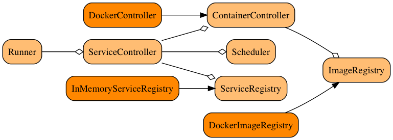

# Service box

A type safe library to define and run test dependencies using scala and Docker containers.

### Status

Not feature-complete yet, will publish a first release soon!

## Containers and integration testing

Scala's strong type system, when used properly, can help avoiding a range of obvious bugs 
(e.g. null pointer exceptions), often removing the need for pedantic, low-level unit testing. 
However, we still find highly valuable testing the integration of several software 
components. It is in fact at this level that we spot most bugs (e.g. serialisation/deserialisation, 
missing configuration values, SQL queries working differently across vendors, race conditions, etc.).

Recently, we have started using Docker to streamline the way we run this type of tests, both on
our development machines and on our continuous integration environment. 
By allowing us to reproduce a realistic production environment with great flexibility and speed, containers
are helping us increase our confidence in our testing and continuous delivery process.

## Key components

The library currently consists of the following modules:

- An "algebra" to define test dependencies (aka `Service`) as aggregates of one or several `Container`.
- An `InMemoryServiceRegistry` that can automatically assign available host ports to a service containers.
- A `Scheduler`, which provides a simple interface suitable to repeatedly check if a service is ready
- "Interpreters" to setup/check/teardown services using Docker as container technology, and `scala.concurrent.Future` or `cats.effect.IO`
as the effect system.

## Modules

- `core`: the core algebra, with built-in support for `scala.concurrent.Future`.
- `core-io`: optional support for `cats.effect.IO`
- `docker`: a docker interpreter for the core algebra.
